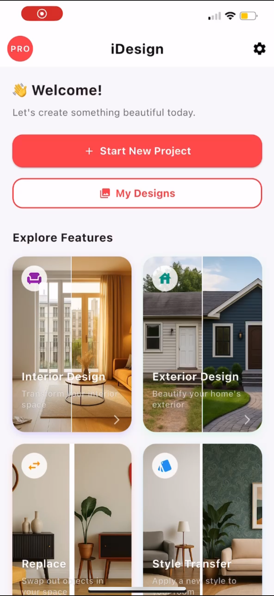
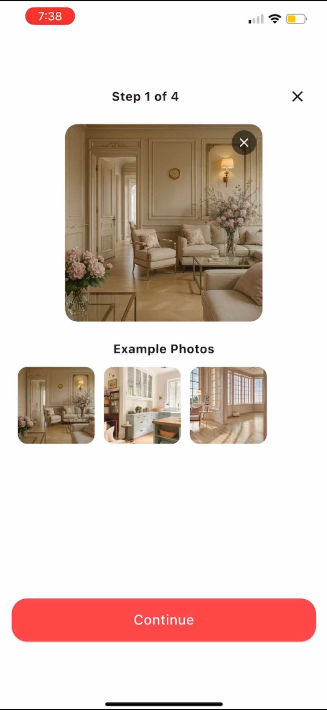
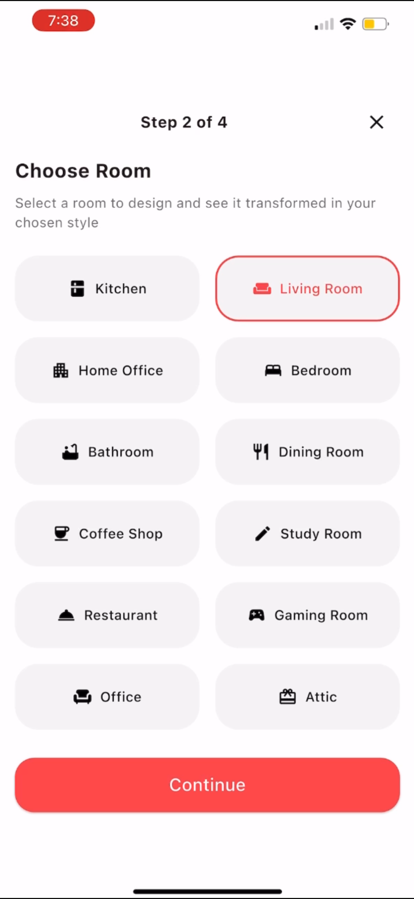
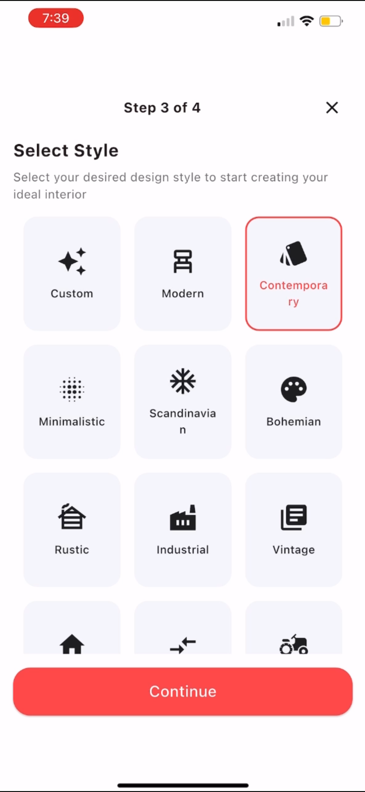
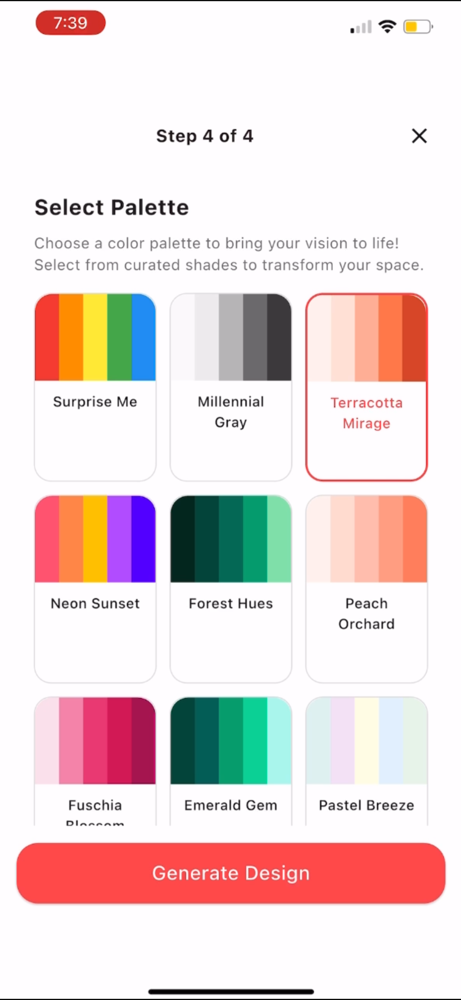

# **iDesign HomeGPT**

## **Overview**

iDesign HomeGPT is an AI powered home design application that enables users to transform interior and exterior spaces using intelligent design workflows. The application provides a guided multi step experience for selecting rooms, styles, and color palettes, and generates visually compelling design outputs using advanced AI models.

The platform is designed with a modern mobile first frontend and a scalable backend architecture that supports image processing, AI inference, and secure user management.

---

## **Key Features**

• AI powered interior and exterior design generation  
• Guided multi step design workflow  
• Multiple room type support  
• Curated design styles and palettes  
• Project based design management  
• Scalable backend with cloud storage  
• Secure authentication and usage control  

---

## **Application Screenshots**

### **Repository Assets Structure**

The following screenshots are maintained inside the repository to document the UI flow and user experience.

### **Home Screen**

The home screen welcomes users and provides entry points to start a new design project or view previously generated designs. It also highlights core features such as Interior Design, Exterior Design, Object Replacement, and Style Transfer.

  

---

### **Step 1: Upload or Select Reference Image**

Users begin by uploading a reference image or selecting from example photos. This image is used as the base input for AI driven transformation.

  

---

### **Step 2: Choose Room Type**

Users select the type of room they want to design. This selection helps tailor the AI output to the spatial and functional characteristics of the chosen room.

Supported room types include living room, bedroom, kitchen, office, dining room, and more.

  

---

### **Step 3: Select Design Style**

Users choose a design style that defines the overall aesthetic of the generated result. Each style is mapped to curated prompts and visual references.

Examples include modern, contemporary, minimalist, Scandinavian, industrial, rustic, and vintage.

  

---

### **Step 4: Select Color Palette and Generate Design**

Users select a curated color palette to further refine the output. Once selected, the system generates a high quality AI enhanced design image based on all chosen parameters.

  

---

## **Frontend Architecture**

The frontend is built as a mobile first application focused on performance, clarity, and smooth user experience.

### **Technology Stack**

• Flutter for cross platform UI development  
• Riverpod for state management  
• GoRouter for navigation and flow control  
• Firebase Authentication for user login  
• Supabase for media storage and user data  

### **Frontend Responsibilities**

• User interface rendering  
• Step based design workflow  
• Image upload and preview  
• Style and palette selection  
• API communication with backend  
• Authentication and access control  

---

## **Backend Architecture**

The backend is designed as a modular and scalable AI processing system.

### **Technology Stack**

• Node.js and Python based services  
• Replicate API for AI image generation  
• Supabase Storage for image assets  
• Firebase and Supabase for user management  
• Cloud deployment using Docker containers  

### **Backend Responsibilities**

• Image preprocessing and validation  
• AI inference orchestration  
• Prompt and style mapping  
• Storage and retrieval of generated designs  
• Rate limiting and usage control  
• Subscription and quota enforcement  

---

## **AI Design Pipeline**

1. User uploads or selects an image  
2. Frontend sends metadata and image reference to backend  
3. Backend prepares prompt using selected room, style, and palette  
4. AI model generates transformed design  
5. Output image is stored in cloud storage  
6. Public URL is returned to frontend  

---

## **Security and Scalability**

• Secure authentication using Firebase  
• Usage limits enforced at backend level  
• Cloud native storage and deployment  
• Modular services for easy scaling  
• Designed to support premium and free tiers  

---

## **Project Status**

The application is actively developed and structured for production deployment. The architecture supports future expansion including additional design tools, real time editing, and collaborative features.

---
## **License**

MIT License © 2026 Kennnnnnyyyyyyyyy

See the [LICENSE](./LICENSE) file for full license text.
